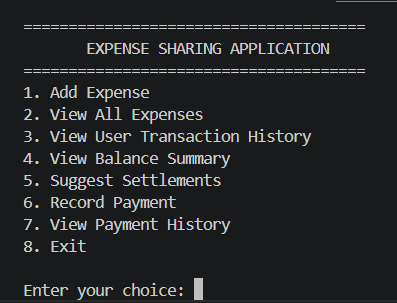
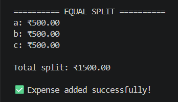
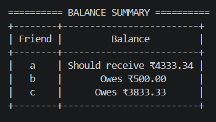
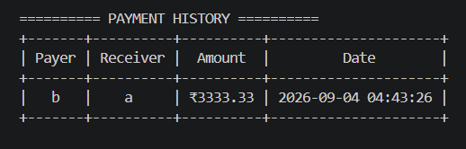

# Expense Sharing Application

A Python-based expense-sharing application that helps multiple users
record, split, track, and settle shared expenses.

## Features

- Add multiple users
- Add expenses with descriptions
- Equal expense splitting
- Custom expense splitting
- Automatic balance calculation
- User transaction history
- Expense history
- Suggested settlements
- Record payments
- Payment history
- SQLite database storage
- Persistent data between application sessions
- Proper handling of rounding in equal splits

## Technologies Used

- Python
- NumPy
- PrettyTable
- SQLite
- VS Code

## Project Structure

```text
Expense_Sharing/
│
├── main.py
├── database.py
├── requirements.txt
├── README.md
├── .gitignore
└── screenshots/

## Screenshots

### Main Menu



### Add Expense



### Balance Summary



### Payment History

